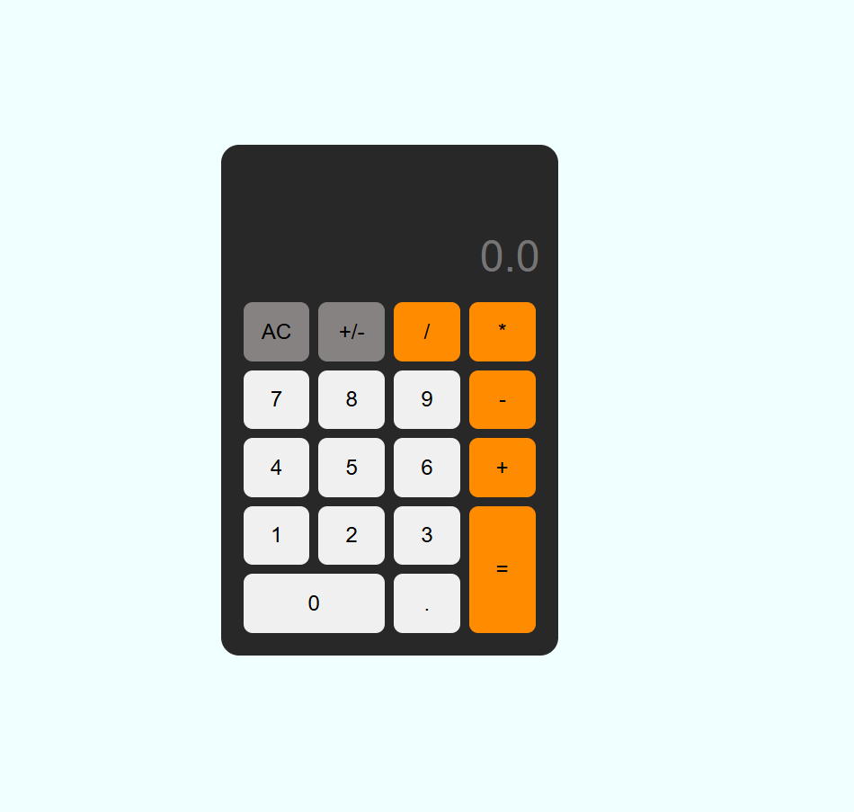

# 🖩 Simple Calculator

A simple and efficient calculator built with JavaScript. This project allows users to perform basic arithmetic operations such as addition, subtraction, multiplication, and division. Designed with a user-friendly interface, it ensures a smooth and intuitive experience.

## 🚀 Features

- Basic arithmetic operations: `+`, `-`, `*`, `/`
- Responsive and user-friendly design
- Lightweight and fast performance

## 📷 Screenshot

## 🛠️ Technologies Used

- HTML
- CSS
- JavaScript

##
